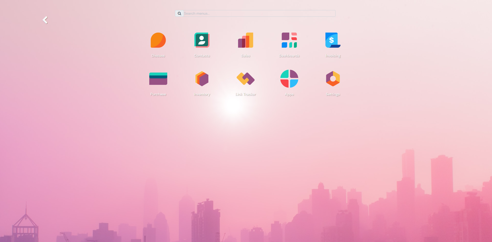

# Odoo 17 Custom Addons Collection
Repository ini berisi kumpulan modul tambahan (addons) yang dikembangkan untuk **Odoo 17 Community/Enterprise**. Modul-modul ini bertujuan untuk meningkatkan fungsionalitas standar dan memperbaiki antarmuka pengguna (UI).

## 🚀 Daftar Modul

### 1. Hue Backend Theme
* **Folder:** `hue_backend_theme`
* **Fungsi:** View / Tampilan backend Odoo menjadi lebih modern dan elegan dengan fitur sidebar yang responsif.
               Theme by : <https://www.cybrosys.com>
* **Fitur Utama:** Custom color palette, modern login page, dan sidebar navigation.

### 2. Modul Tambahan KTP & NPWP
* **Folder:** `ktp_management` 
* **Fungsi:** Menambahkan field identitas NIK dan fitur upload foto KTP pada formulir Kontak (res.partner).
* **Fokus:** Validasi data pelanggan/karyawan yang lebih akurat.

### 3. Modul WA otomatis dari Odoo ke pembeli / penjual (res.partner)
* **Folder:** `whatsapp_integration`
* **Fungsi:** Menambahkan fitur untuk bagian sales atau keuangan untuk kirim notifikasi melalui whastapp mereka dengan API testing fonnte
* **Fokus:** untuk notifikasi dan pemberitahuan langsung ke penjual atau pembeli melalui whatsapp.

### 4. Modul ODoo ERP Real-Time Synchronizer API marketplace with Anti-Overselling Engine
* **Folder:** `whatsapp_integration`
* **Fungsi:** Mengurangi beban administrasi dengan mengotomatisasi pembuatan dokumen penjualan, Sinkronisasi Stok Instan (Event-Driven), Transaksional & Concurrency Control, Mengunci baris database produk (FOR UPDATE NOWAIT) saat proses reservasi pesanan online
* **Fokus:** untuk alur kirim dan terima stok dari erp odoo ke API e-commerce
👉 [**Baca Dokumentasi Lengkap di Academia.edu**](https://www.academia.edu/165230608/MODUL_INTEGRASI_ODOO_API)


## 🛠️ Cara Instalasi

1. **Clone Repository:**
   ```bash
   git clone -b 17.0 [https://github.com/dianpransisko/odoo-custom-addons.git](https://github.com/dianpransisko/odoo-custom-addons.git)
